# State Machines

## Chat Thread (Dictionary + Tutor)

```mermaid
stateDiagram-v2
    [*] --> Idle
    Idle --> Composing : user types (mode retained)
    Composing --> Sending : press Send
    Sending --> DictionaryCard : mode = dictionary / translation success
    Sending --> TutorCard : mode = tutor / response ready
    Sending --> Error : service failure
    DictionaryCard --> SavedToBank : Add pressed / stored locally
    DictionaryCard --> FolderSheet : Folder pressed
    DictionaryCard --> SavedToNotes : NN pressed → create note
    TutorCard --> MemoryLogged : Understood tapped
    FolderSheet --> DictionaryCard : Save or Cancel
    MemoryLogged --> Idle
    SavedToBank --> Idle
    SavedToNotes --> Idle
    Error --> Idle : dismiss banner / retry
```

Key guards:
- `FolderSheet` only available when `bankItemId` exists.
- `Understood` chip disabled once logged to memory graph.
- Offline state short-circuits `Add` action (no remote sync required).

## Adaptive Activity Planner

Notes:
- `SequenceBuilder` prioritises SRS due items, then frequent errors, then continuity heuristics.
- `ActivityInProgress` sub-steps (Translation, Flashcards, etc.) report completion metrics that feed the memory graph.
- UI implementation currently surfaces duration picker and activity definitions; sequencing hook ready for future integration.
