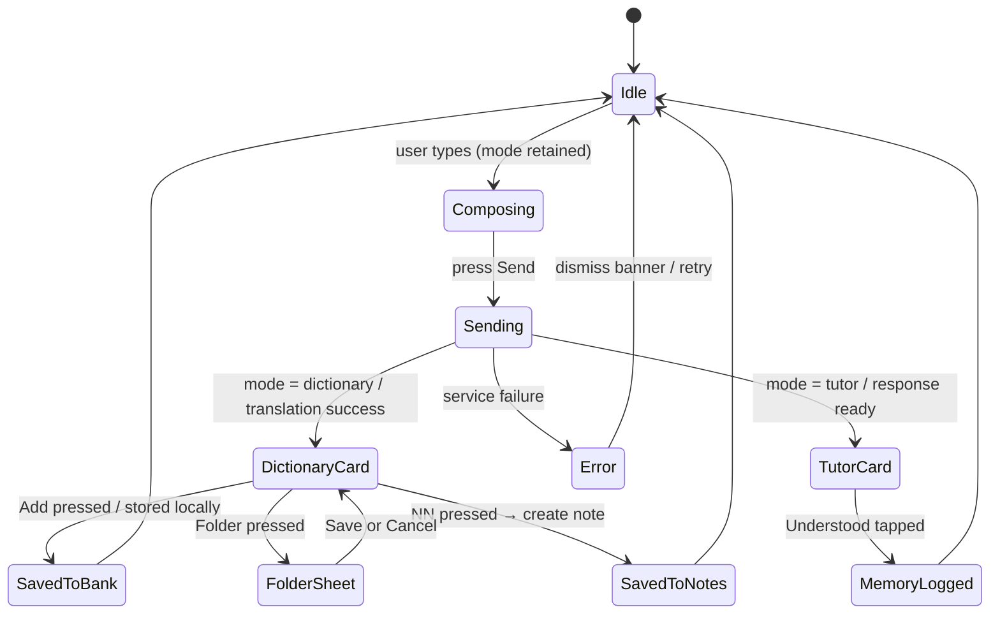
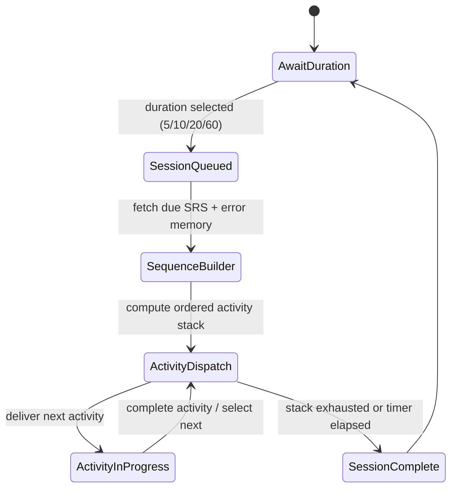
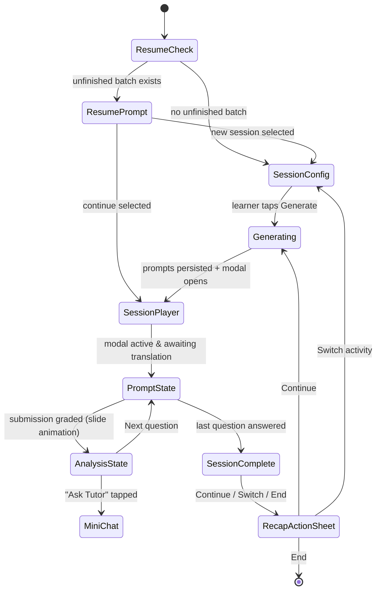
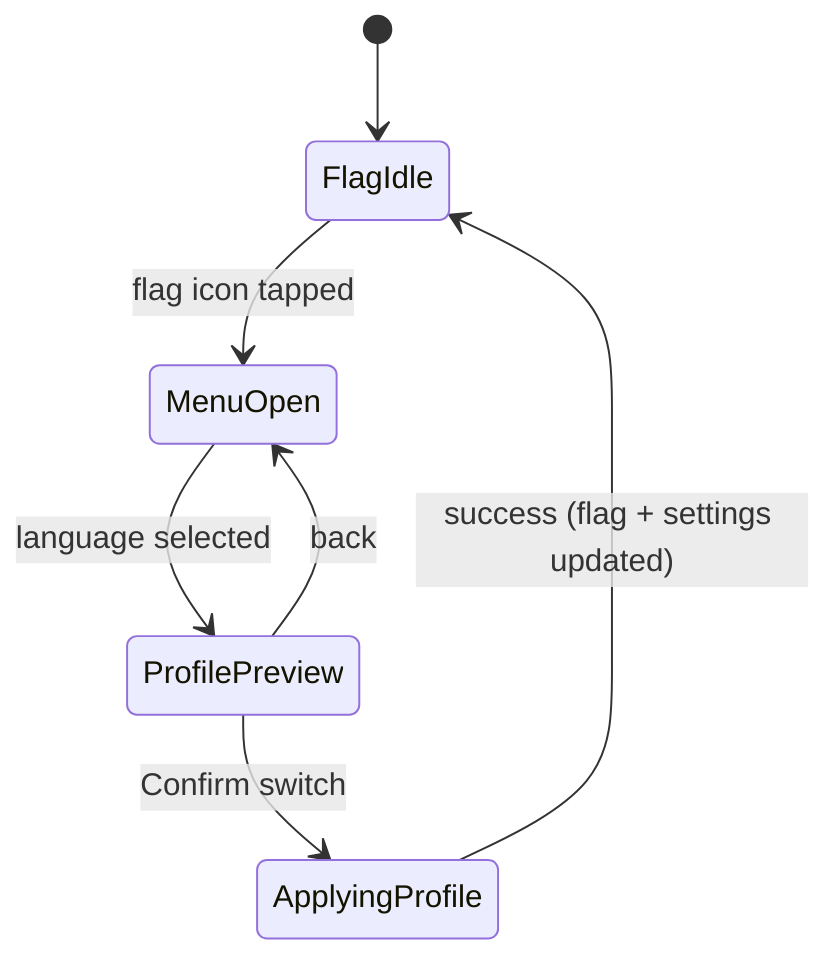
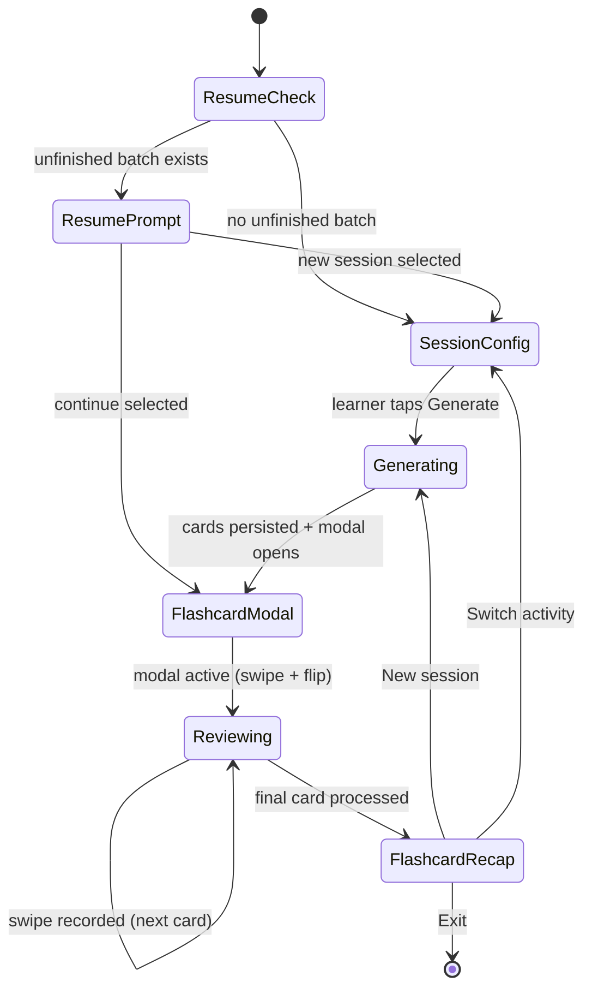

# State Machines

## Chat Thread (Dictionary + Tutor)

Key guards:
- `FolderSheet` only available when `bankItemId` exists.
- `Understood` chip disabled once logged to memory graph.
- Offline state short-circuits `Add` action (no remote sync required).

## Adaptive Activity Planner

Notes:
- `SequenceBuilder` prioritises SRS due items, then frequent errors, then continuity heuristics.
- `ActivityInProgress` sub-steps (Translation, Flashcards, etc.) report completion metrics that feed the memory graph.
- UI implementation currently surfaces duration picker and activity definitions; sequencing hook ready for future integration.

## Translation Tutor Flow

Implementation notes:
- `SessionPlayer` lives inside a slide-up modal; closing it early preserves `progress.currentIndex` so the learner can resume later.
- Each `AnalysisState` exposes actions: add to native notes, flag for SRS priority, open a scoped mini-chat thread, or move on.
- Flagging an item immediately queues an SRS review with a short interval; removing the flag restores the normal cadence.
- Generation respects the learner’s `reviewMode`, `questionCount`, `styleMix`, and `topicTags` before persisting the batch locally.

## Language Profile Switcher (Flag Menu)

Details:
- Each menu entry shows language, region badge, and last activity timestamp pulled from `LanguageProfile`.
- `ApplyingProfile` refreshes the home screen flag asset, injects the profile into the Adaptive Activity Planner, and reloads due SRS queues scoped to that language.
- When a learner adds a new language, a fresh `LanguageProfile` is created, ensuring history and personalization remain per-language/per-region. Flag icon state reflects the active profile at all times.

## Flashcard Training Flow

Notes:
- Swipe right = correct, swipe left = needs more review. Each swipe updates the Spaced Repetition store immediately for the linked vocab item so progress isn’t lost if the learner exits mid-session.
- Tapping the card flips between term and definition with a vertical flip animation.
- The tracker in the modal header shows `done/total`, plus real-time counts for “Need review” vs “Mastered”.
- Flagging a card marks it for high-priority SRS scheduling until the flag is removed.
